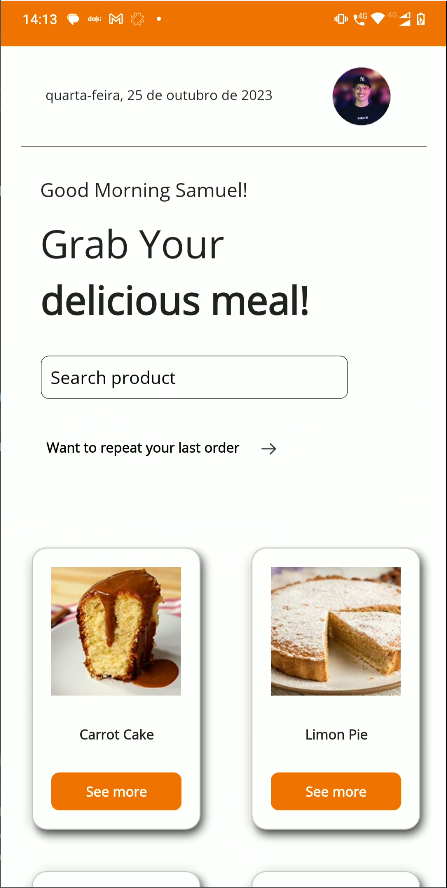
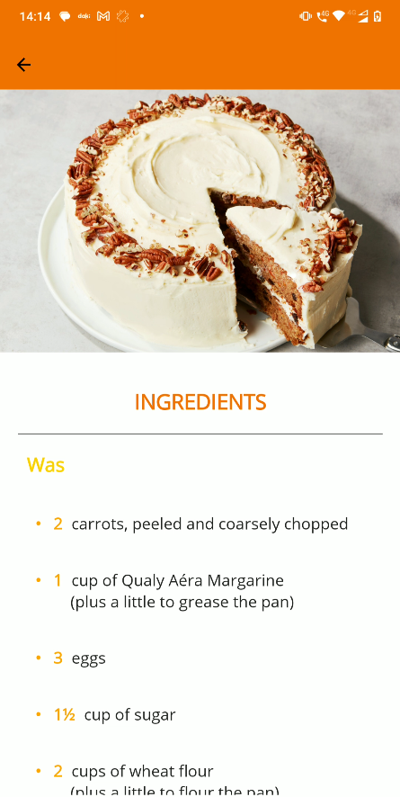
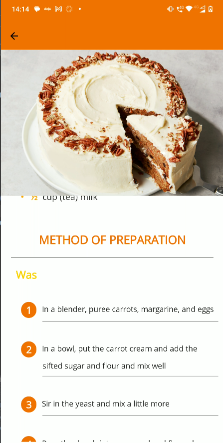
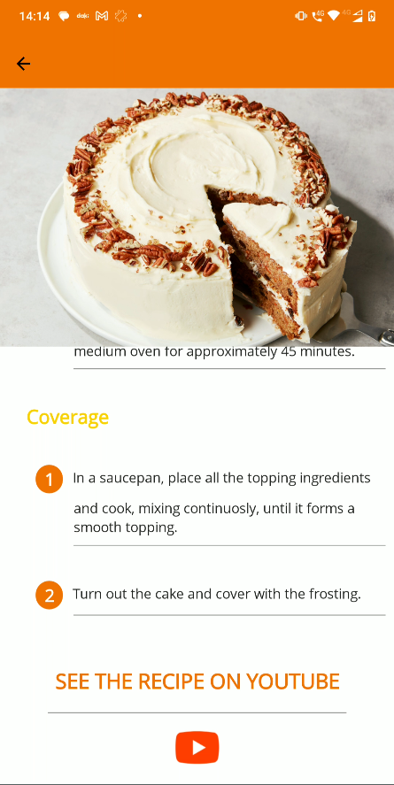
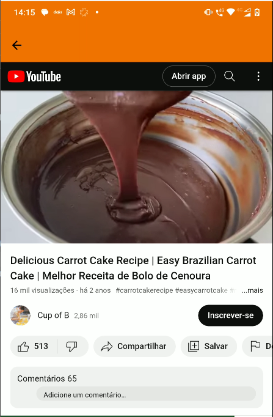

## Savor the Flavor with our Recipe App!

Welcome to our recipe app, a one-stop solution for all your culinary adventures. Built with .NET MAUI, our app offers a seamless and responsive experience across all platforms.

Whether you’re a seasoned chef or a beginner in the kitchen, our app is designed to inspire and assist you. With thousands of recipes at your fingertips, you’ll discover dishes from around the world.

Our app features include:

Search and Discover: Find recipes based on ingredients you have, or explore new dishes from various cuisines.
Step-by-Step Guides: Each recipe comes with detailed instructions and images to guide you through the cooking process.
Save and Share: Save your favorite recipes for easy access and share them with friends and family.
Personalized Recommendations: Get recipe suggestions tailored to your taste preferences.
Join us on this gastronomic journey and bring out the chef in you with our .NET MAUI recipe app! Happy cooking! 🍽️

## Interface:

